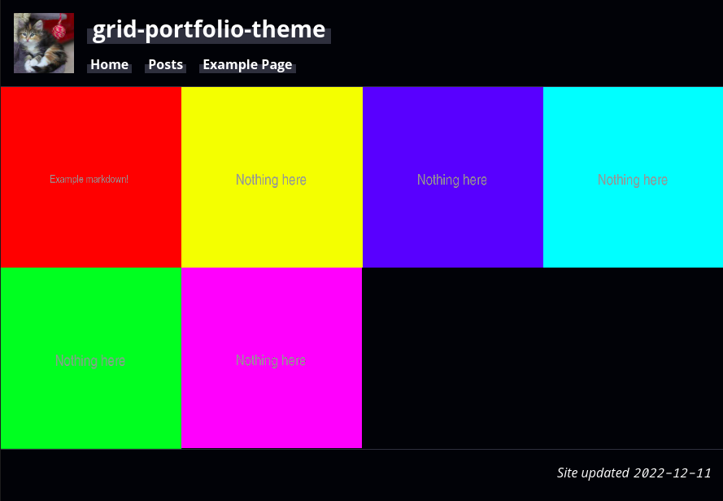

# grid-portfolio-theme

<p align="center">
  
</p>

## Usage

### GitHub Pages

The theme can be easily used on GitHub pages by including the following in your `_config.yml`:

```yaml
remote_theme: bdshrk/grid-portfolio-theme
```

Make sure to remove any other references to themes from the config first!

### Layouts

The theme includes three layouts;
- `portfolio`, containing the grid display used in `index.markdown`.
- `page`, used for most pages that are not posts (do not require a pubish date or table of contents).
- `post`, used for posts.

### Front Matter

Make sure each post has a `splash` variable in the front matter that points to an image file to use as the grid background. Example:

```yaml
---
layout: post
title: Example Markdown Showcase
splash: https://via.placeholder.com/512/ff0000?text=Example+markdown!
tags: a_tag c_tag b_tag
---
```

For a page to have a link in the navbar, give it the `navindex` front matter and assign it a number. The index is relative, where lower indexes are positioned to the left, and higher to the right. Example:

```yaml
---
layout: page
title: "Example Page"
navindex: 5
---
```

### Style Customisation

You can also customise the fonts and colours used by the theme from the file located at `assets/css/style.scss`. See the comments in that file for more information.

## Contributing

Bug reports and pull requests are welcome on GitHub at [https://github.com/bdshrk/grid-portfolio-theme](https://github.com/bdshrk/grid-portfolio-theme).

## Credits

- jekyll-toc used in this theme is available [here](https://github.com/allejo/jekyll-toc).
- The hover effect was modified from the original, which is available [here](https://codepen.io/nelsonr/pen/WNQaZPb).
- Placeholder images from [https://placeholder.com/](https://placeholder.com/) and [https://placekitten.com/](https://placekitten.com/).

## License

The theme is available as open source under the terms of the [MIT License](https://opensource.org/licenses/MIT).
